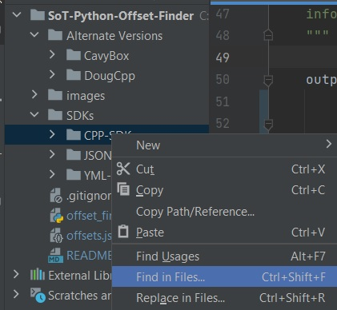

# SoT-Python-Offset-Finder
https://github.com/DougTheDruid/SoT-ESP-Framework relies on an "offset.json" file to determine the 
memory offsets to pull data from memory. The memory offsets are stored within the SoT SDK files under
their respective parent objects. So instead of hard-coding them or trying to build them ourselves, we 
utilize this helper program to build the file for us, given we have an up-to-date SDK dump for the game.
This program simply offers a more simple structure to keep our hack working as expected. If you need 
assistance with the code, **please contact me on Discord: DougTheDruid#2784**

I attempt to manage my own dump of the SDK, but it is not guaranteed to be up-to-date. If you believe 
it outdated, please reach out to me via Discord and I will do my best to update it ASAP. There
are also a number of folks on UnknownCheats who offer GitHub repos where they update the SDK. If using
an SDK that I do not provide, you may need to adjust the `offset_finder.py` to ensure the mappings
to the filenames are correct.

## How to Use
Clone this repo, then within the folder created, load in the current SoT SDK into an "SDK" folder if it is not
up-to-date,  ensure the `offset_finder.py` global variables are pointing to the correct paths (at the top 
of the file), and simply "run" the offset finder script.

As you develop your version of the framework further, you can update the dictionary being built in this
file to automatically pull the offsets you are utilizing. You will primarily utilize the three SDK files 
highlighted in the global variables.

## How to search the SDK
1) Find an interesting actor name. For this example, we will use `IslandService`
   1) "How do I find an interesting actor name?"
      1) Printing out all the actors in the console is going to be the easiest. 
      2) Create a "Debug mode" that allows you to see all actors in the world via 3D ESP, 
         then you may be able to determine the names for a specific actor
2) Search for `IslandService` in an SDK
   1) If you are using PyCharm (as I am, and as I recommend) follow these steps:
      1) Right click the SDK folder and select "Find In Files"
      
      2) In the newly opened window, enter the key you want to search for, in our case `IslandService`
      
      3) This will give you an entire list of where `IslandService` is mentioned in the SDK.
      4) Note: The "pin" icon at the top right of the window will allow you to keep the search window open, and I have found it useful
3) We then need to find the class for `IslandService`. In this case it is `class AIslandService : public AActor`
   1) Classes often starts with a U or A in the SDK before the actual name 
   2) Searching for `<actor name> :` may also help condense the list to just classes
   3) A class will likely be a subclass of another parent class; so in this situation, `AIslandService` is a subclass to `AActor`. 
   That effectively means you can also use the memory offsets/data from the superclass as well (`AActor` in this case). 
4) Once we have identified our class object in the SDK, we can investigate the offsets associated with each of the classes, 
   these will often be described under the `public:` section in our class. At the time of writing, `AIslandService` has a subclass of `UIslandDataAsset` located at `0x0458`,
   if we want to pull data from the `UIslandDataAsset` class, we need to get the pointer located at `AIslandService`+`0x0458`, then we effectively repeat steps 3 & 4 until we find data we are interested in.

Notes:
- Often on forums, you will see folks describe this as "AIslandService>UIslandDataAsset>SpawningGracePeriod", effectively this means we will get out `AIslandService` object, get the address for `UIslandDataAsset`, then read `SpawningGracePeriod` (a float) to get the data we want
- Don't forget you can utilize the memory addresses from superclasses as well, often times it is very useful!

