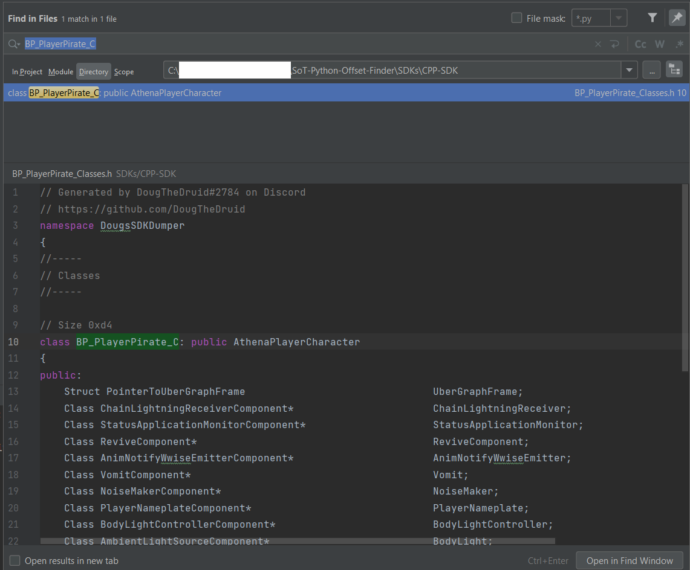

# CURRENT VERSION
The SDK's provided are currently built for the following version of the game: 2.7.3

# SoT-Python-Offset-Finder
https://github.com/DougTheDruid/SoT-ESP-Framework relies on an "offset.json" file to determine the 
memory offsets to pull data from memory. The memory offsets are stored within the SoT SDK files under
their respective parent objects. So instead of hard-coding them or trying to build them ourselves, we 
utilize this helper program to build the file for us, given we have an up-to-date SDK dump for the game.
This program simply offers a more simple structure to keep our hack working as expected. If you need 
assistance with the code, **please contact me on Discord: DougTheDruid#2784**

I attempt to manage my own dump of the SDK, but it is not guaranteed to be up-to-date. If you believe 
it outdated, please reach out to me via Discord and I will do my best to update it ASAP. There
are also a number of folks on UnknownCheats who offer GitHub repos where they update the SDK. If using
an SDK that I do not provide, you may need to adjust the `offset_finder.py` to ensure the mappings
to the filenames are correct.

## How to Use
Clone this repo. Within the folder created ensure the `offset_finder.py` global variables are pointing to the correct paths for your up-to-date JSON SDK (at the top 
of the file), and "run" the offset finder script. _**The offset_finder here will only work with my custom JSON
SDK's, if you need a normal C++ equivalent file reader, see `/Alternate Versions/DougCpp`.**_

There are currently 3 version of the SDK I generate using my own methods:
1) C++ - This is a roughly C++ equivalent SDK, it can be a bit easier to find new objects in this kind of structure
2) JSON - The same data, stored in JSON format. My preferred method to programmatically pull data
3) YAML - The same data, stored in YAML format. Others may prefer to use this for programmatic access to the data

As you develop your version of the framework further, you can update the dictionary being built in this
file to automatically pull the offsets you are utilizing. You will primarily utilize the three SDK files 
highlighted in the global variables, but may need to add more as you work with the SDK.

## SDK Utilization
In order to search the SDK, I generally recommend you first have an "interesting actor name" identified that will serve
as a starting point. https://github.com/DougTheDruid/SoT-ESP-Framework#finding-interesting-actors will walk through this
identification process a bit more in-depth. For the sake of this walk-through, I am going to make the following assumptions:
1) We have gone through the identification steps and determined that all actors with a name of `BP_PlayerPirate_C` are players in the game (yourself, allies, etc.) within render distance
2) I will be using the C++ SDK as it is easier to navigate in my experience
3) You are using PyCharm or another IDE which has a "Find in Files" feature

With those assumptions out of the way, lets get started:
1) Let's open our SoT-Python-Offset-Finder project and expand the "SDKs" folder to reveal the three SDK types
2) Right-click the `CPP-SDK` folder and select "Find In Files"

   

   This will open a new window that will allow you to search any of the files within the `CPP-SDK` directory, because we don't
know what file we want to look in, "Find in Files" is a necessity until we figure that out
3) We are looking for the `BP_PlayerPirate_C` entity, so lets just start by searching for that in the top search bar

   

   In this case, we have a single result, but there is a lot of good information here that we can break down a bit:
   1) Once you select a result, you will see which file the result was from at the top of the code portion, in our case "BP_PlayerPirate_Classes.h"
   2) Once you select a result, it will take you to where in that file the searched text is found in the file
   3) For `*_Classes.h` files, you will always have the following components:
      1) There will be a Size value above each class (calculated using offsets later on)
      2) The name of the class: `class BP_PlayerPirate_C`
      3) The name of the parent class: `public AthenaPlayerCharacter`
      4) There is a list of public attributes the class contains, for each of which there are three primary subcomponents
         1) The type of the attribute (A pointer to another class, struct, integer, bool, float, etc.)
         2) The name attribute, just used for identification purposes
         3) The offset the attributes lives at for the class
   4) For `*_Struct.h` files, you will have the following components
      1) There will be a Size value above each struct (calculated using offsets later on)
      2) The name of the struct
      3) There is a list of public attributes the struct contains, for each of which there are three primary subcomponents
         1) The type of the attribute (A pointer to another class, struct, integer, bool, float, etc.)
         2) The name attribute, just used for identification purposes
         3) The offset the attributes lives at for the struct
         
With that general understanding out of the way, lets cover a couple of these topics more in depth:

### Optimizing Searches
You may not be so lucky to find a single result in a search, but there are a couple of useful tips to help find the appropriate:
- If you are searching for a class (something you found in a Debug-mode in-game, or a `class` pointer reference, etc.), you can generally search for `class <your class name>:`
which should yield a single result.
- If you are looking for a struct, you can search for `struct <struct name>\n` after enabling the regex search pattern on the right of the search bar

### Pointers to Classes
You may come across a number of `Class <name here>*`-type attributes in the SDK. These are almost always 8-bytes in size
and represent the base-address/location of a sub-class. For example, we have a class with the following attribute:
```
Class StaggerComponent*                                      StaggerComponent;                                  // 0xd00(0x8)
```
If I perform a `stagger_component = read_ptr(actor_addres+0xD00)` function call, it will return a _new_ actor address that I can reference as it relates
to my original actor. We have stored that new address in `stagger_component`, which we can read the data from that
sub-class by looking up the attributes of a `class StaggerComponent:` and reading the data located at `stagger_component+<offset>`

### Understanding Offsets & Parent Classes
In our class files, most classes will have a "Parent" class, which are an extremely important concept to grasp prior to beginning
to work with memory in UE4. Ultimately this comes down to a complex programming concept called inheritance. In short, a child object
(e.g. `BP_PlayerPirate_C`), automatically inherits all the attributes of its parent(s) (e.g. `AthenaPlayerCharacter`). But what does that really mean?

The best way to describe this is with an example:
Lets say you're looking at the attributes available for `BP_PlayerPirate_C` and decide that `TattooGlowDuration` is an 
interesting field:
```
float                                                        TattooGlowDuration;                                // 0x1ae8(0x4)
```
(Note: your SDK offsets may vary from my examples, but follow along with what I provide)

We will already know what our `BP_PlayerPirate_C`'s base-address is from the framework, lets pretend its `0xABC1234`. We also 
know the offset `TattooGlowDuration` lives at is `0x1AE8`, is a float-type, and a size of 4-bytes. If we simply
perform a `read_float(0xABC1234+0x1AE8)` call, we will get the float which represents our TattooGlowDuration.

As another note, generally we won't even "know" our actors addresses, we just refer to it by the address variable that the framework generates.

Who really cares about TattooGlowDuration though?! We want more interesting stuff! Let's say you start to look at the remaining
attributes available in `BP_PlayerPirate_C` and you don't find anything you are interested in. That's where parent classes can
be so helpful.

We know that `BP_PlayerPirate_C` is a child of `AthenaPlayerCharacter`, so lets look that parent class up in the SDK:


Now this has a ton more information, nearly 100 attributes here alone! Before we get ahead of ourselves and look at the attributes,
there is something important you may have noticed, `AthenaPlayerCharacter` also has its own parent of `AthenaCharacter`. Classes
can be nested infinitely deep and compound on one another. The entire chain to create a `BP_PlayerPirate_C` looks something like:
`Unreal Object>Actor>Pawn>Character>AthenaCharacter>AthenaPlayerCharacter>BP_PlayerPirate_C`. So in reality, anytime we have 
an object of `BP_PlayerPirate_C`, it is inheriting the attributes of _**all**_ the parent classes as well.

What does this mean for us though? 

Continuing looking back at `class AthenaPlayerCharacter:` lets say we determine `FinishedWaitingForSpawn` to be a field we want to track:
```
bool                                                         FinishedWaitingForSpawn;                           // 0x1a00(0x1)
```
You may be inclined to think there is some sorcery you must do in order to read data from the parent classes, but alas there is no
magic here. Because classes automatically inherit all the attributes of parent-classes, reading the memory at `<child address>+<offset>`
works the exact same way as our previous `TattooGlowDuration` example, the offset is just different. So in this scenario, it would be `read_bool(0xABC1234+0x1A00)`. A keen
eye may also recognize that the ranges of offsets for parent objects never overlaps or results in duplicates, validating this concept further.

### Structs
Like pointers to other classes, structs can be another complex topic. For our purposes, a `struct` is simply a defined
group of data that is consistently organized in the same way. If we continue along with our example of looking at our `AthenaPlayerCharacter`
class, we will find that there is a struct called `ServerSprintConditionParams` of type `Struct SprintConditionsParams` located
at offset `0xE10`. It is also worth noting that this struct has a size of `0xC`, which is 12-bytes. 
```
Struct SprintConditionsParams                                ServerSprintConditionParams;                       // 0xe10(0xc)
```
The "type" of this attribute is `Struct SprintConditionsParams`, so lets look that up in the SDK. You should get a single result of:
```
// Size 0xc
struct SprintConditionsParams
{
public:
	float                                                        ForwardInputVectorTolerance;                       // 0x0(0x4)
	float                                                        MinVelocityForwardDot;                             // 0x4(0x4)
	float                                                        MinVelocityMagnitude;                              // 0x8(0x4)
};
```
Related to our comment before, we can see the size of this struct is `0xC`, and it's comprised of three floats. Pretending we
are interested in `MinVelocityForwardDot` out of this struct, how would we go about reading that float? Well, we know how to read
out of the parent class already (reminder: it's the same as the child class), and we know the offset of our struct, perhaps you need to read
it as if it was a pointer, similar to that section?

This is often the first thought when working with structs, but is incorrect. Struct's are a way for us to create custom data-types
as opposed to relying on floats, ints, pointers, etc. There is no extra layer to a struct, it's simply the way the data is structured
at that location (`0xE10` in our example). In order to read `MinVelocityForwardDot`, we simply read the float at `actor_address+0xE10+0x4`.
The first offset brings us to the start of our struct and the addition of the second offset allows us to pull thatgit
value directly.

### Your Own Offset-Finder
As you go through and find offsets that you find important, hard-coding those offset values is a poor idea; not only could there
be issues if there is an update to the game (and therefore SDK), but how will you remember what these random numbers are responsible for?
This is the purpose of the `offsets.json` and `offset_finder.py` files. 

`offsets.json` is a way that we store useful offset externally to our ESP Framework. Instead of having a magic number to represent
my offsets, I can instead pull the values from this file with a human-readable, descriptive name. If we open the included
`offsets.json` file, we see that there is an entry called `PlayerController.CameraManager` equal to an integer. `PlayerController`
is the class we pulled data from, and `CameraManager` is the specific attribute name we want to use for that class. Referencing
`offsets.get('PlayerController.CameraManager')` in my code helps make it clear what offset I am pulling, what class type I should
be adding it to (`PlayerController`), and provides a single place to update if there are any changes to the game/SDK.

`offset_finder.py` is program to generate an `offsets.json` file given a list of offsets you want to pull from the SDK. If
you are to add new features to your hack and begin to rely on additional offsets from the SDK, you should be sure to add the appropriate
information into your own `offset_finder.py` so you can update your `offsets.json` file at your leisure should there be an update to the game/SDK.
To add entries, you provide the file name you want to pull from, the class or struct name, and the attribute you want the offset of, and it pulls it 
from the JSON SDK automatically for simple updates in the future.

